<div align="center">


# AI Vibe Coding Starter

### **From Idea to Production in One Conversation**

[](https://opensource.org/licenses/MIT)
[](./CONTRIBUTING.md)

[简体中文](./README_cn.md) | English


---

**The ultimate lazy developer's dream: Tell AI your idea, get a production-ready website.**

One template. One conversation. Zero manual setup.

[Get Started](#-quick-start) · [Features](#-features) · [How It Works](#-how-it-works)

</div>

---

## ✨ What is This?

**AI Vibe Coding Starter** is a hyper-modern template designed for the AI-first development era.

> **"I have an idea for a project..."**
>
> That's all you need to say. AI handles the rest.

This isn't just another starter template. It's a **complete automation system** that lets AI coding assistants (Claude Code, Codex, OpenCode, Cursor) take you from concept to deployed website with:

- Zero configuration headaches
- Zero deployment struggles
- Zero Stack Overflow copy-pasting
- **Pure vibe coding**

### 🎯 The Core Magic: PRD-Driven Automation

Traditional starters make you manually update dozens of files. **Not this one.**

```
docs/config.md    →  Your project settings (name, domain, colors...)
docs/prd.md       →  Your product requirements
```

AI reads these files and **automatically**:

- Replaces `[project-name]`, `[repo-name]`, `[github-username]` everywhere
- Updates `site-info.ts`, `package.json`, `LICENSE`, workflows...
- Generates README, GitHub templates, landing page content
- Creates proper conventional commits
- Deploys to Cloudflare Pages

**You write the PRD. AI does the grunt work.**

### 📊 Complete Workflow

```mermaid
flowchart LR
    subgraph INPUT [" "]
        A["📝 Clone + Config"]
    end

    subgraph AI ["🤖 AI Automation"]
        B["Phase 1<br/>Core Config"] --> C["Phase 2<br/>Visual Assets"]
        C --> D["Phase 3<br/>Documentation"]
        D --> E["Phase 4<br/>Verify & Commit"]
    end

    subgraph OUTPUT [" "]
        F["🚀 Deploy"]
    end

    A --> B
    E --> F

    style INPUT fill:#e1f5fe
    style AI fill:#f3e5f5
    style OUTPUT fill:#e8f5e9
```



<details>
<summary>📋 Detailed Workflow (click to expand)</summary>

| Phase       | What AI Does                                                                                                                |
| ----------- | --------------------------------------------------------------------------------------------------------------------------- |
| **Setup**   | Clone template → Create `docs/config.md` & `docs/prd.md` → Tell AI "Start setup"                                            |
| **Phase 1** | Replace placeholders in `site-info.ts` → Update `package.json`, `LICENSE`, workflows → Configure theme → `pnpm typecheck` ✓ |
| **Phase 2** | Customize landing page → Update logo & favicon → Visual review ✓                                                            |
| **Phase 3** | Delete template READMEs → Generate project README → Create GitHub templates → No placeholders left ✓                        |
| **Phase 4** | `pnpm lint && typecheck` → Run `validate-setup.sh` → Conventional commit ✓                                                  |
| **Deploy**  | `git push` → GitHub Actions CI → Cloudflare Pages → Site Live! ✅                                                           |

</details>

---

## 🎯 The Problem We Solve

| 😫 Traditional Starters                            | 🎉 AI Vibe Coding Starter                              |
| :------------------------------------------------- | :----------------------------------------------------- |
| Clone then manually edit N files with placeholders | Fill `config.md`, AI replaces all + generates files    |
| Manually create GitHub Issues/PRs                  | `/fix-github-issue`, `/create-pr` - one command        |
| Manually configure Cloudflare Pages deployment     | AI runs `wrangler` to create Pages, bind KV/R2/D1      |
| Want to add MCP? Edit 4 config files manually      | `/mcp-manager add xxx` syncs all AI tools at once      |
| Not AI Ready                                       | Claude Code / Codex / Cursor / OpenCode all supported  |
| "How does this starter work?" Read docs for ages   | Tell AI your idea, it reads `CLAUDE.md` and guides you |

---

## 🚀 Features

### 🤖 AI-Native Architecture

- **CLAUDE.md / AGENTS.md** - Comprehensive instructions for AI assistants
- **CHECKLIST.md** - Progress tracking AI can update
- **PRD-driven** - Write requirements, AI implements
- **MCP configs** - Pre-configured for Claude Code, Codex, Cursor, OpenCode

### 🎮 Built-in AI Commands

Pre-configured slash commands for common workflows:

| Command                     | Description                                       |
| --------------------------- | ------------------------------------------------- |
| `/create-pr`                | Create PR with Angular commit convention          |
| `/fix-github-issue`         | Analyze and fix GitHub issues automatically       |
| `/code-review`              | Review code for quality, security, best practices |
| `/review-pr`                | Review pull requests with structured feedback     |
| `/commit`                   | Create conventional commits                       |
| `/add-changelog`            | Generate changelog entries                        |
| `/prepare-release`          | Prepare version releases                          |
| `/mcp-manager`              | Manage MCP configs across all 4 AI tools          |
| `/nextjs-performance-audit` | Audit Next.js performance                         |

### 🧩 Shared Skills

Reusable AI capabilities (symlinked across tools):

| Skill              | Description                                                |
| ------------------ | ---------------------------------------------------------- |
| `resource-scout`   | Search & discover MCP servers and skills from marketplaces |
| `skill-creator`    | Guide for creating new custom skills                       |
| `skill-downloader` | Download & install skills from GitHub or archives          |

### ⚡ Production-Ready Stack

| Technology   | Version | Purpose           |
| ------------ | ------- | ----------------- |
| Next.js      | 15      | React framework   |
| React        | 19      | UI library        |
| Nextra       | 4       | Documentation     |
| Tailwind CSS | 4       | Styling           |
| shadcn/ui    | Latest  | Component library |
| TypeScript   | 5       | Type safety       |
| pnpm         | 10+     | Package manager   |

### 🔧 Engineering Excellence

- **Husky + Commitlint** - Angular commit convention enforced
- **ESLint + Prettier** - Code quality automated
- **GitHub Actions** - CI/CD out of the box
- **PR title validation** - Conventional commits for PRs too
- **Cloudflare Pages** - Deploy on merge, preview on PR

### 📁 Multi-Tool Compatibility

**One codebase, all AI tools supported.**

MCP configs (one per tool, synced content):

```
.mcp.json           → Claude Code
.cursor/mcp.json    → Cursor
.codex/config.toml  → Codex
opencode.json       → OpenCode
```

Shared via symlinks:

```
AGENTS.md           → CLAUDE.md        # Universal AI instructions
.cursor/skills/     → .claude/skills/  # Shared skills
.codex/skills/      → .claude/skills/
.opencode/skill/    → .claude/skills/
```

Write once in `.claude/`, all tools benefit.

---

## 🎬 How It Works

### Step 1: Clone & Tell AI Your Idea

```bash
git clone https://github.com/user/ai-vibe-coding-starter my-project
cd my-project
```

Then open Claude Code (or Codex, or Cursor, or OpenCode) and say:

> "I want to build a documentation site for my CLI tool called 'FastDeploy'.
> It helps developers deploy apps faster. The domain will be fastdeploy.dev."

### Step 2: AI Does Everything

The AI will:

1. Read `CLAUDE.md` for instructions
2. Ask clarifying questions (colors, social links, etc.)
3. Update `site-info.ts` with your config
4. Customize the landing page
5. Generate README from your PRD
6. Create GitHub templates
7. Run `pnpm typecheck && pnpm lint`
8. Commit with proper conventional commits

### Step 3: Deploy

```bash
# AI can do this too
gh repo create my-project --public --push
# Cloudflare Pages auto-deploys on push to main
```

**That's it. You're live.**

---

## 📦 What's Included

```
├── CLAUDE.md                 # AI instruction manual (AGENTS.md symlinks here)
├── CHECKLIST.md              # Setup progress tracker
│
├── .mcp.json                 # Claude Code MCP config
├── .cursor/mcp.json          # Cursor MCP config
├── .codex/config.toml        # Codex MCP config
├── opencode.json             # OpenCode MCP config
│
├── .claude/
│   ├── commands/             # Custom AI commands (/create-pr, /mcp-manager...)
│   └── skills/               # Shared skills (source directory)
│       ├── resource-scout/
│       ├── skill-creator/
│       └── skill-downloader/
├── .cursor/skills/           # → symlink to .claude/skills/
├── .codex/skills/            # → symlink to .claude/skills/
├── .opencode/skill/          # → symlink to .claude/skills/
│
├── .github/
│   ├── actions/              # Reusable composite actions
│   ├── workflows/            # CI/CD pipelines (ci.yml, deploy-website.yml)
│   └── *.example.*           # Issue/PR templates (copy & rename to use)
│
├── website/                  # Next.js 15 + Nextra 4 + shadcn/ui + Tailwind 4
│   ├── src/
│   │   ├── components/       # React components (landing page, shared)
│   │   ├── lib/site-info.ts  # Central config (edit here, applies globally)
│   │   └── styles/           # Global styles and theme colors
│   ├── content/              # Nextra docs content (EN/ZH bilingual)
│   └── public/               # Static assets (icon.svg, og-image...)
│
├── docs/
│   ├── config.example.md     # Project config template
│   └── prd.example.md        # PRD template
│
└── scripts/
    └── validate-setup.sh     # Verify setup completeness
```

---

## ⚡ Quick Start

### Prerequisites

- Node.js 24+
- pnpm 10+
- GitHub CLI (`gh`)
- Cloudflare CLI (`wrangler`)
- An AI coding assistant (Claude Code, Codex, Cursor, or OpenCode)

### 1. Use This Template

```bash
# Clone
git clone https://github.com/user/ai-vibe-coding-starter my-awesome-project
cd my-awesome-project

# Install
pnpm install
```

### 2. Talk to AI

Open your AI coding tool and say:

> "Help me set up this template for my project. Here's my idea: [describe your project]"

The AI will guide you through everything.

### 3. Verify Setup

```bash
./scripts/validate-setup.sh
```

### 4. Ship It

```bash
pnpm dev:website  # Preview locally
gh repo create    # Create GitHub repo
git push          # Deploy to Cloudflare
```

---

## 🧠 For AI Assistants

If you're an AI reading this: **check `CLAUDE.md`** for detailed instructions.

Key files:

- `CLAUDE.md` - Your complete guide
- `CHECKLIST.md` - Track your progress
- `docs/config.md` - User's pre-filled config (if exists)
- `docs/prd.md` - User's requirements (if exists)

---

## 🤝 Contributing

This is a template, so contributions that improve the AI experience are especially welcome!

- Improve `CLAUDE.md` instructions
- Add more AI commands in `.claude/commands/`
- Enhance MCP configurations
- Better automation scripts

See [CONTRIBUTING.md](./CONTRIBUTING.md) for guidelines.

---

## 📄 License

MIT © [Jinming Yang](https://github.com/2214962083)

---

<div align="center">

**Stop configuring. Start shipping.**

The future of development is conversational. This template is your on-ramp.

<br />

_Built for the lazy. Engineered for the ambitious._

</div>
