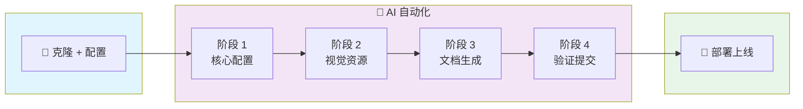

<div align="center">


# AI Vibe Coding Starter

### **从想法到上线，只需一次对话**

[](https://opensource.org/licenses/MIT)
[](./CONTRIBUTING.md)

简体中文 | [English](./README.md)


---

**懒人终极福音：告诉 AI 你的想法，收获一个生产级网站。**

一个模板。一次对话。零手动配置。

[快速开始](#-快速开始) · [特性](#-特性) · [工作原理](#-工作原理)

</div>

---

## ✨ 这是什么？

**AI Vibe Coding Starter** 是为 AI 优先开发时代打造的超现代模板。

> **"我有一个项目想法..."**
>
> 这就是你需要说的全部。AI 会处理剩下的一切。

这不仅仅是又一个启动模板。它是一个**完整的自动化系统**，让 AI 编程助手（Claude Code、Codex、OpenCode、Cursor）带你从概念到部署：

- 零配置烦恼
- 零部署困扰
- 告别 Stack Overflow 复制粘贴
- **纯粹的 Vibe Coding**

### 🎯 核心魔法：PRD 驱动的自动化

传统 starter 让你手动改几十个文件。**这个不用。**

```
docs/config.md    →  你的项目配置（名称、域名、颜色...）
docs/prd.md       →  你的产品需求文档
```

AI 读取这些文件，**自动**：

- 替换所有 `[project-name]`、`[repo-name]`、`[github-username]`
- 更新 `site-info.ts`、`package.json`、`LICENSE`、workflows...
- 生成 README、GitHub 模板、落地页内容
- 创建规范的约定式提交
- 部署到 Cloudflare Pages

**你写 PRD，AI 干脏活累活。**

### 📊 完整工作流



<details>
<summary>📋 详细流程（点击展开）</summary>

| 阶段       | AI 执行内容                                                                                            |
| ---------- | ------------------------------------------------------------------------------------------------------ |
| **准备**   | 克隆模板 → 创建 `docs/config.md` 和 `docs/prd.md` → 告诉 AI "开始配置"                                 |
| **阶段 1** | 替换 `site-info.ts` 占位符 → 更新 `package.json`、`LICENSE`、workflows → 配置主题 → `pnpm typecheck` ✓ |
| **阶段 2** | 定制落地页 → 更新 logo 和 favicon → 视觉检查 ✓                                                         |
| **阶段 3** | 删除模板 README → 生成项目 README → 创建 GitHub 模板 → 无占位符残留 ✓                                  |
| **阶段 4** | `pnpm lint && typecheck` → 运行 `validate-setup.sh` → 约定式提交 ✓                                     |
| **部署**   | `git push` → GitHub Actions CI → Cloudflare Pages → 网站上线！ ✅                                      |

</details>

---

## 🎯 我们解决的问题

| 😫 传统 Starter                      | 🎉 AI Vibe Coding Starter                        |
| :----------------------------------- | :----------------------------------------------- |
| 克隆后手动改 N 个文件里的占位符      | 填 `config.md`，AI 一次性全局替换 + 生成适配文件 |
| 手动创建 GitHub Issue/PR             | `/fix-github-issue`、`/create-pr` 一句话搞定     |
| 手动配置 Cloudflare Pages 部署       | AI 调用 `wrangler` 自动创建 Pages、绑 KV/R2/D1   |
| 想加个 MCP？4 个工具配置文件改 4 遍  | `/mcp-manager add xxx` 一句话同步所有 AI 工具    |
| 没有 AI 友好性                       | Claude Code / Codex / Cursor / OpenCode 全适配   |
| "这个 starter 怎么用？" 看文档半小时 | 告诉 AI 你的想法，它读 `CLAUDE.md` 带你走完全程  |

---

## 🚀 特性

### 🤖 AI 原生架构

- **CLAUDE.md / AGENTS.md** - 给 AI 助手的完整指南
- **CHECKLIST.md** - AI 可更新的进度追踪
- **PRD 驱动** - 写需求，AI 来实现
- **MCP 配置** - 预配置 Claude Code、Codex、Cursor、OpenCode

### 🎮 内置 AI 命令

预配置的斜杠命令，覆盖常见工作流：

| 命令                        | 描述                             |
| --------------------------- | -------------------------------- |
| `/create-pr`                | 创建符合 Angular 规范的 PR       |
| `/fix-github-issue`         | 自动分析并修复 GitHub issue      |
| `/code-review`              | 代码审查（质量、安全、最佳实践） |
| `/review-pr`                | 结构化的 PR 审查                 |
| `/commit`                   | 创建约定式提交                   |
| `/add-changelog`            | 生成 changelog 条目              |
| `/prepare-release`          | 准备版本发布                     |
| `/mcp-manager`              | 管理 4 个 AI 工具的 MCP 配置     |
| `/nextjs-performance-audit` | Next.js 性能审计                 |

### 🧩 共享 Skills

可复用的 AI 能力（通过软链接跨工具共享）：

| Skill              | 描述                               |
| ------------------ | ---------------------------------- |
| `resource-scout`   | 从市场搜索发现 MCP 服务器和 skills |
| `skill-creator`    | 创建新自定义 skill 的指南          |
| `skill-downloader` | 从 GitHub 或压缩包下载安装 skills  |

### ⚡ 生产级技术栈

| 技术         | 版本 | 用途       |
| ------------ | ---- | ---------- |
| Next.js      | 15   | React 框架 |
| React        | 19   | UI 库      |
| Nextra       | 4    | 文档系统   |
| Tailwind CSS | 4    | 样式       |
| shadcn/ui    | 最新 | 组件库     |
| TypeScript   | 5    | 类型安全   |
| pnpm         | 10+  | 包管理     |

### 🔧 工程卓越

- **Husky + Commitlint** - Angular 提交规范强制执行
- **ESLint + Prettier** - 代码质量自动化
- **GitHub Actions** - CI/CD 开箱即用
- **PR 标题校验** - PR 也遵循约定式提交
- **Cloudflare Pages** - 合并即部署，PR 即预览

### 📁 多工具兼容架构

**一套代码，所有 AI 工具通用。**

MCP 配置（每个工具一份，内容同步）：

```
.mcp.json           → Claude Code
.cursor/mcp.json    → Cursor
.codex/config.toml  → Codex
opencode.json       → OpenCode
```

通过软链接共享：

```
AGENTS.md           → CLAUDE.md        # 通用 AI 指令
.cursor/skills/     → .claude/skills/  # 共享 skills
.codex/skills/      → .claude/skills/
.opencode/skill/    → .claude/skills/
```

在 `.claude/` 写一次，所有工具都能用。

---

## 🎬 工作原理

### 第一步：克隆 & 告诉 AI 你的想法

```bash
git clone https://github.com/2214962083/vibe-coding-starter my-project
cd my-project
```

然后打开 Claude Code（或 Codex、Cursor、OpenCode）说：

> "我想为我的 CLI 工具 'FastDeploy' 建一个文档网站。
> 它帮助开发者更快地部署应用。域名是 fastdeploy.dev。"

### 第二步：AI 搞定一切

AI 会：

1. 阅读 `CLAUDE.md` 获取指引
2. 问你澄清问题（颜色、社交链接等）
3. 用你的配置更新 `site-info.ts`
4. 定制落地页
5. 根据 PRD 生成 README
6. 创建 GitHub 模板
7. 运行 `pnpm typecheck && pnpm lint`
8. 用规范的约定式提交

### 第三步：部署

```bash
# AI 也能帮你做这个
gh repo create my-project --public --push
# Cloudflare Pages 在 push 到 main 时自动部署
```

**搞定。你已经上线了。**

---

## 📦 包含什么

```
├── CLAUDE.md                 # AI 指令手册（AGENTS.md 软链接指向它）
├── CHECKLIST.md              # 配置进度追踪
│
├── .mcp.json                 # Claude Code MCP 配置
├── .cursor/mcp.json          # Cursor MCP 配置
├── .codex/config.toml        # Codex MCP 配置
├── opencode.json             # OpenCode MCP 配置
│
├── .claude/
│   ├── commands/             # 自定义 AI 命令（/create-pr, /mcp-manager...）
│   └── skills/               # 共享 Skills（源目录）
│       ├── resource-scout/
│       ├── skill-creator/
│       └── skill-downloader/
├── .cursor/skills/           # → .claude/skills/ 软链接
├── .codex/skills/            # → .claude/skills/ 软链接
├── .opencode/skill/          # → .claude/skills/ 软链接
│
├── .github/
│   ├── actions/              # 可复用的组合 action
│   ├── workflows/            # CI/CD 流水线（ci.yml, deploy-website.yml）
│   └── *.example.*           # Issue/PR 模板（复制并重命名使用）
│
├── website/                  # Next.js 15 + Nextra 4 + shadcn/ui + Tailwind 4
│   ├── src/
│   │   ├── components/       # React 组件（落地页、共享组件）
│   │   ├── lib/site-info.ts  # 集中配置（改这里，全局生效）
│   │   └── styles/           # 全局样式和主题色
│   ├── content/              # Nextra 文档内容（中英双语）
│   └── public/               # 静态资源（icon.svg, og-image...）
│
├── docs/
│   ├── config.example.md     # 项目配置模板
│   └── prd.example.md        # PRD 模板
│
└── scripts/
    └── validate-setup.sh     # 验证配置完整性
```

---

## ⚡ 快速开始

### 前置要求

- Node.js 24+
- pnpm 10+
- GitHub CLI (`gh`)
- Cloudflare CLI (`wrangler`)
- 一个 AI 编程助手（Claude Code、Codex、Cursor 或 OpenCode）

### 1. 使用这个模板

```bash
# 克隆
git clone https://github.com/2214962083/vibe-coding-starter my-awesome-project
cd my-awesome-project

# 安装
pnpm install
```

### 2. 和 AI 对话

打开你的 AI 编程工具，说：

> "帮我用这个模板配置我的项目。我的想法是：[描述你的项目]"

AI 会引导你完成一切。

### 3. 验证配置

```bash
./scripts/validate-setup.sh
```

### 4. 发布！

```bash
pnpm dev:website  # 本地预览
gh repo create    # 创建 GitHub 仓库
git push          # 部署到 Cloudflare
```

---

## 🧠 给 AI 助手

如果你是正在阅读这个的 AI：**查看 `CLAUDE.md`** 获取详细指引。

关键文件：

- `CLAUDE.md` - 你的完整指南
- `CHECKLIST.md` - 追踪你的进度
- `docs/config.md` - 用户预填的配置（如果存在）
- `docs/prd.md` - 用户的需求文档（如果存在）

---

## 🤝 参与贡献

这是一个模板，所以改善 AI 体验的贡献特别欢迎！

- 改进 `CLAUDE.md` 指引
- 在 `.claude/commands/` 添加更多 AI 命令
- 增强 MCP 配置
- 更好的自动化脚本

查看 [CONTRIBUTING.md](./CONTRIBUTING.md) 了解贡献指南。

---

## 📄 开源协议

MIT © [Jinming Yang](https://github.com/2214962083)

---

<div align="center">

**别再配置了。开始发布吧。**

开发的未来是对话式的。这个模板是你的入口。

<br />

_为懒人打造。为有野心的人设计。_

</div>
